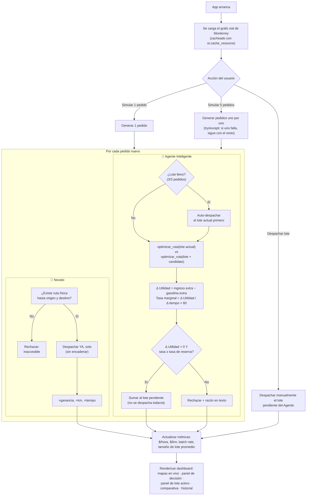

# DynaRoute (Python) — Agente Autónomo vs. Repartidor Novato

App de Streamlit que compara, sobre la red vial real de Monterrey
(OpenStreetMap vía OSMnx), a un repartidor "Novato" (acepta cualquier
pedido) contra un "Agente Inteligente" que solo acepta pedidos cuyo
rendimiento **EPUT** (pago ÷ minutos totales) supera un umbral configurable.

## 🧭 Diagrama de flujo



## Qué cambió en esta versión

El motor (`rutamonterrey.py`, `simulador_pedidos.py`) es el mismo que ya
tenían — solo se rediseñó `app.py`:

- **Tema visual real** vía `.streamlit/config.toml` (dark + acento cian),
  en vez de trucos de CSS que se rompen entre versiones de Streamlit.
- **Pestañas** en vez de scroll infinito: `🗺️ Simulación en vivo`,
  `📊 Comparativa`, `📋 Historial`, `🧠 Reporte IA`.
- **El dashboard comparativo ya no depende de Gemini.** Antes, las
  gráficas de ganancia neta vs. gasolina y los deltas de rentabilidad
  solo aparecían si tenías una API key de Gemini Y le dabas clic a
  "Generar Reporte". Ahora viven en su propia pestaña, siempre visibles
  en cuanto hay al menos un pedido simulado.
- **Botón para simular 5 pedidos de golpe**, además del de uno solo —
  para no tener que dar clic diez veces en una demo en vivo.
- **La calle bloqueada ahora se puede reabrir.** Antes, una vez que
  bloqueabas Av. Gonzalitos el cierre era permanente hasta reiniciar la
  app a mano (el grafo se mutaba en el caché compartido). El botón ahora
  cambia a "Reabrir" y limpia el caché para recargar el grafo completo.
- Se quitaron imports que no se usaban (`json`, `evaluar_orden`) y se
  centralizó el cálculo de ganancia/gasto/rentabilidad en una sola
  función (`calcular_metricas`) para que el panel de mapas, la
  comparativa y el prompt de Gemini nunca muestren números distintos.

No se subió `tempCodeRunnerFile.py` (era un archivo temporal que genera
la extensión "Code Runner" de VS Code al ejecutar un script — no forma
parte del proyecto).

## Qué cambió en esta versión (v2: batching + dashboard)

Además de los cambios de interfaz de la primera revisión, esta versión le
agrega al **Agente Inteligente** una capacidad que no tenía: **cargar
varios pedidos a la vez** (batching), usando el mismo enfoque de utilidad
marginal que la versión React/TypeScript del proyecto (`routeOptimizer.ts`
+ `decisionEngine.ts`), pero aplicado sobre la red vial real de Monterrey
en vez de estimaciones de línea recta.

- **Nuevo archivo `optimizador_batch.py`** (no modifica `rutamonterrey.py`
  de tu compañero, solo lo usa): dado un lote de pedidos ya aceptados más
  uno candidato, prueba todas las secuencias de recolección/entrega que
  respetan "recoger antes de entregar" y se queda con la de mayor
  utilidad. Decide aceptar el candidato solo si su **utilidad marginal**
  es positiva Y su **tasa marginal** (MXN/hora que aporta ESE pedido
  específico) supera una **tasa de reserva** configurable — evita que el
  agente acepte pedidos técnicamente rentables pero que diluyen su
  rendimiento general.
- **El Novato sigue sin encadenar** (acepta y despacha cada pedido solo,
  de inmediato) — el contraste con el Agente es justamente el punto.
- **Interfaz al estilo del dashboard de la versión React**: tarjetas de
  métricas, panel de "Decisión del agente" (utilidad marginal, tasa
  marginal, tiempo/distancia extra, razón en texto), panel de "Lote
  activo" mostrando qué trae cargado el agente ahora mismo, y botón
  "🚚 Despachar lote" para forzar la entrega de un lote parcial.
- **Nuevos parámetros medidos** (tomados de la versión React): $/hora,
  $/km, batch rate (% de pedidos entregados que fueron parte de un lote
  de 2+), tamaño de lote promedio.

Probado de punta a punta (mockeando streamlit/osmnx, sin necesitar
instalarlos) simulando 15 pedidos: el Agente rechazó los pedidos con tasa
marginal negativa o insuficiente, encadenó el resto en lotes de 2-3, y
terminó con **~2.9× más MXN/hora** que el Novato.

## Ajustes visuales y de robustez (v3)

- **Tarjetas con ícono en su propia caja** (como en el dashboard de
  referencia), en vez del ícono pegado al texto de la etiqueta.
- **Insignia "X/Y entregados"** junto al título de cada panel (Novato /
  Agente), igual que "4/82 delivered" en la versión React.
- **Fila de estadísticas al pie** de cada panel: batch rate y gasto de
  gasolina, con el gasto resaltado en rojo si es negativo.
- **"Simular 5 pedidos" ya no se cae si una ruta es imposible.** Antes,
  si `calcular_ruta()` lanzaba una excepción (por ejemplo, un nodo
  aislado tras un bloqueo vial), el lote completo de 5 pedidos se
  abortaba. Ahora `optimizador_batch.py` atrapa esa excepción en el
  punto exacto donde ocurre (un solo tramo imposible) y lo trata como
  "sin ruta" en vez de dejar que reviente toda la evaluación -- los
  demás pedidos del lote de 5 se siguen procesando con normalidad.
  Probado forzando fallas artificiales en 1 de cada 7 rutas: 15 pedidos
  simulados, 0 errores propagados.

## Instalación

```bash
python -m venv .venv
source .venv/bin/activate   # en Windows: .venv\Scripts\activate
pip install -r requirements.txt
```

> **Nota sobre OSMnx**: depende de GeoPandas/Fiona/GDAL. En la mayoría de
> sistemas `pip install osmnx` funciona directo. Si falla la instalación
> en Windows, la alternativa más simple es instalar OSMnx vía conda:
> `conda install -c conda-forge osmnx`.

## Ejecución

```bash
streamlit run app.py
```

La primera vez que corres la app, va a **descargar la red vial de
Monterrey desde OpenStreetMap** (puede tardar uno o dos minutos) y la
guarda en caché local (`monterrey_metro_drive.graphml`, ignorado por git
por su tamaño). Las siguientes veces carga instantáneo desde ese caché.

Si vas a presentar en un lugar sin internet confiable, corre la app una
vez de antemano con internet para generar ese caché.

## Reporte con Gemini (opcional)

En la pestaña "🧠 Reporte IA" puedes pegar una API key de Google Gemini
(gratis en [Google AI Studio](https://aistudio.google.com/)) para generar
un reporte narrativo de fin de turno. Es completamente opcional — el
resto de la app (mapas, comparativa, historial) funciona sin ella.

## Estructura

```
app.py                  # interfaz Streamlit (dashboard + panel de decisión + lote activo)
optimizador_batch.py     # NUEVO: batching + utilidad marginal para el Agente Inteligente
rutamonterrey.py         # grafo vial real + regla de decisión EPUT (sin tocar)
simulador_pedidos.py     # generador de pedidos mock (sin tocar)
requirements.txt
.streamlit/config.toml   # tema visual
```
